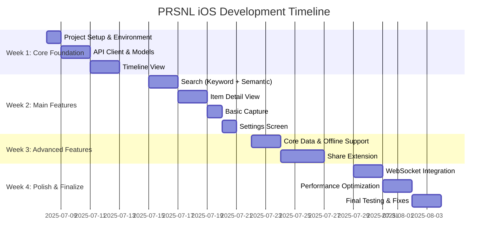

# PRSNL iOS App - Implementation Plan

## 1. Project Overview

The PRSNL iOS app is a native companion app for the PRSNL personal knowledge management system. This document outlines the implementation approach, timeline, and technical considerations.

### Core Requirements
- Native iOS companion app for PRSNL knowledge management system
- Only work in `/PRSNL-iOS/` directory, no backend modifications
- Backend running on port 8000 with API Key authentication
- MVP features: Timeline, Search, Item Detail, Capture, Settings

### Technical Stack
- SwiftUI (iOS 17.0+)
- MVVM with Combine
- Core Data + SwiftData
- URLSession with async/await
- Keychain for API key storage

## 2. Backend Setup

```bash
# Navigate to the backend directory
cd /Users/pronav/Personal Knowledge Base/PRSNL

# Start the backend services
docker-compose up

# The backend will be available at:
# http://localhost:8000

# Verify it's running:
curl http://localhost:8000/health
# Should return: {"status":"healthy"}

# Test API Key:
export PRSNL_API_KEY=test-api-key-for-development
```

## 3. Implementation Timeline



## 4. Project Directory Structure

```
PRSNL-iOS/
├── Implementation/
│   ├── PRSNL.xcodeproj
│   ├── PRSNL/
│   │   ├── App/
│   │   │   ├── PRSNLApp.swift
│   │   │   └── AppDelegate.swift
│   │   ├── Core/
│   │   │   ├── API/
│   │   │   │   ├── APIClient.swift
│   │   │   │   ├── APIEndpoints.swift
│   │   │   │   └── APIError.swift
│   │   │   ├── Models/
│   │   │   │   ├── Models.swift
│   │   │   │   └── CoreDataModels.xcdatamodeld
│   │   │   ├── Services/
│   │   │   │   ├── AuthenticationService.swift
│   │   │   │   ├── CacheService.swift
│   │   │   │   └── SyncService.swift
│   │   │   └── Extensions/
│   │   │       ├── ColorExtensions.swift
│   │   │       ├── DateExtensions.swift
│   │   │       └── StringExtensions.swift
│   │   ├── Features/
│   │   │   ├── Timeline/
│   │   │   │   ├── TimelineView.swift
│   │   │   │   └── TimelineViewModel.swift
│   │   │   ├── Search/
│   │   │   │   ├── SearchView.swift
│   │   │   │   └── SearchViewModel.swift
│   │   │   ├── Capture/
│   │   │   │   ├── CaptureView.swift
│   │   │   │   └── CaptureViewModel.swift
│   │   │   ├── ItemDetail/
│   │   │   │   ├── ItemDetailView.swift
│   │   │   │   └── ItemDetailViewModel.swift
│   │   │   └── Settings/
│   │   │       ├── SettingsView.swift
│   │   │       └── SettingsViewModel.swift
│   │   └── Shared/
│   │       ├── Components/
│   │       │   ├── ItemCard.swift
│   │       │   ├── TagChip.swift
│   │       │   ├── LoadingView.swift
│   │       │   └── ErrorView.swift
│   │       ├── Styles/
│   │       │   ├── ButtonStyles.swift
│   │       │   └── TextStyles.swift
│   │       └── Utils/
│   │           ├── ImageCache.swift
│   │           └── Logger.swift
│   ├── PRSNLTests/
│   └── PRSNLShareExtension/ (Week 3)
├── Coordination/
│   ├── IMPLEMENTATION_STATUS.md
│   ├── API_INTEGRATION_LOG.md
│   └── DAILY_UPDATES.md
```

## 5. Week-by-Week Implementation Details

### Week 1: Core Foundation

#### Day 1: Project Setup & Environment
1. **Create Xcode Project**
   - Name: PRSNL
   - Interface: SwiftUI
   - Language: Swift
   - Minimum iOS: 17.0
   - Include Core Data: Yes

2. **Configure Project**
   - Setup Manchester United theme (#DC143C)
   - Configure SwiftUI previews
   - Setup project organization

3. **Setup Coordination Documents**
   - Initialize IMPLEMENTATION_STATUS.md
   - Create API_INTEGRATION_LOG.md
   - Setup DAILY_UPDATES.md

#### Days 2-3: API Client & Models
1. **Create API Client**
   ```swift
   class APIClient {
       static let shared = APIClient()
       private let baseURL = "http://localhost:8000/api"
       private var apiKey: String? {
           KeychainService.shared.get(.apiKey)
       }
       
       private var headers: [String: String] {
           var headers = ["Content-Type": "application/json"]
           if let apiKey = apiKey {
               headers["X-API-Key"] = apiKey
           }
           return headers
       }
       
       // MARK: - Request Methods
       func request<T: Decodable>(_ endpoint: String, method: String = "GET", 
                                 body: Encodable? = nil) async throws -> T {
           // Implementation
       }
       
       // MARK: - Specific Endpoints
       func fetchTimeline(page: Int = 1) async throws -> TimelineResponse {
           // Implementation
       }
       
       // Additional endpoints...
   }
   ```

2. **Implement Models**
   - Copy base models from SWIFT_MODELS.md
   - Add Attachment model for the recent backend update
   - Create extensions for validation
   - Setup custom date encoder/decoder

3. **Keychain Service**
   ```swift
   enum KeychainKey: String {
       case apiKey
       case serverURL
   }
   
   class KeychainService {
       static let shared = KeychainService()
       
       func save(_ key: KeychainKey, value: String) -> Bool {
           // Implementation
       }
       
       func get(_ key: KeychainKey) -> String? {
           // Implementation
       }
       
       func delete(_ key: KeychainKey) -> Bool {
           // Implementation
       }
   }
   ```

#### Days 4-5: Timeline View
1. **TimelineViewModel**
   ```swift
   class TimelineViewModel: ObservableObject {
       @Published var items: [TimelineItem] = []
       @Published var isLoading = false
       @Published var error: Error?
       @Published var page = 1
       @Published var hasMorePages = true
       
       func loadInitialItems() async {
           // Implementation with performance tracking
       }
       
       func loadMoreItems() async {
           // Implementation with pagination
       }
       
       func refresh() async {
           // Implementation
       }
   }
   ```

2. **TimelineView**
   ```swift
   struct TimelineView: View {
       @StateObject private var viewModel = TimelineViewModel()
       
       var body: some View {
           NavigationView {
               ZStack {
                   List {
                       ForEach(viewModel.items) { item in
                           ItemCard(item: item)
                               .onAppear {
                                   // Check if near end for pagination
                               }
                       }
                       
                       if viewModel.hasMorePages && !viewModel.isLoading {
                           ProgressView()
                               .onAppear {
                                   // Load more items
                               }
                       }
                   }
                   .refreshable {
                       // Pull to refresh
                   }
                   
                   // Loading and error states
               }
               .navigationTitle("Timeline")
           }
           .task {
               // Initial load
           }
       }
   }
   ```

3. **ItemCard Component**
   ```swift
   struct ItemCard: View {
       let item: TimelineItem
       
       var body: some View {
           VStack(alignment: .leading) {
               // Title
               // Summary
               // Thumbnail from attachments or thumbnailUrl
               // Tags using TagChip
               // Date
           }
           .padding()
           .background(Color.prsnlSurface)
           .cornerRadius(8)
       }
   }
   ```

### Week 2: Main Features

#### Days 1-2: Search Implementation
1. **SearchViewModel**
   ```swift
   enum SearchMode {
       case keyword
       case semantic
   }
   
   class SearchViewModel: ObservableObject {
       @Published var query = ""
       @Published var results: [SearchResult] = []
       @Published var isLoading = false
       @Published var error: Error?
       @Published var searchMode: SearchMode = .keyword
       @Published var recentSearches: [String] = []
       
       private var searchTask: Task<Void, Never>?
       
       func search() {
           // Implement with debouncing (300ms)
           // Cancel previous requests
       }
       
       func performSearch() async {
           // Implementation
       }
       
       func addToRecentSearches(_ query: String) {
           // Implementation
       }
   }
   ```

2. **SearchView**
   ```swift
   struct SearchView: View {
       @StateObject private var viewModel = SearchViewModel()
       
       var body: some View {
           VStack {
               // Search bar with debounce
               // Mode toggle (keyword/semantic)
               // Results list
               // Recent searches
               // Empty state
           }
       }
   }
   ```

#### Days 3-4: Item Detail View
1. **ItemDetailViewModel**
   ```swift
   class ItemDetailViewModel: ObservableObject {
       @Published var item: Item?
       @Published var isLoading = false
       @Published var error: Error?
       @Published var similarItems: [Item] = []
       
       func loadItem(id: UUID) async {
           // Implementation
       }
       
       func findSimilarItems() async {
           // Implementation
       }
       
       func updateTags(_ tags: [String]) async {
           // Implementation
       }
   }
   ```

2. **ItemDetailView**
   ```swift
   struct ItemDetailView: View {
       @StateObject private var viewModel = ItemDetailViewModel()
       let itemId: UUID
       
       var body: some View {
           ScrollView {
               VStack(alignment: .leading) {
                   // Title
                   // Content
                   // Attachments gallery
                   // Tags with editing
                   // Similar items
                   // Share button
               }
           }
           .navigationTitle(viewModel.item?.title ?? "")
           .toolbar {
               // Find similar button
               // Share button
           }
           .task {
               // Load item
           }
       }
   }
   ```

3. **AttachmentsGallery Component**
   ```swift
   struct AttachmentsGallery: View {
       let attachments: [Attachment]
       let baseURL: String
       
       var body: some View {
           // Image gallery with paging
       }
   }
   ```

#### Day 5: Basic Capture & Settings
1. **CaptureViewModel**
   ```swift
   class CaptureViewModel: ObservableObject {
       @Published var url = ""
       @Published var title = ""
       @Published var content = ""
       @Published var tags: [String] = []
       @Published var isLoading = false
       @Published var error: Error?
       @Published var recentTags: [String] = []
       @Published var successMessage: String?
       
       func captureItem() async {
           // Implementation
       }
       
       func loadRecentTags() async {
           // Implementation
       }
       
       func validateInput() -> Bool {
           // Implementation
       }
   }
   ```

2. **CaptureView**
   ```swift
   struct CaptureView: View {
       @StateObject private var viewModel = CaptureViewModel()
       
       var body: some View {
           Form {
               // URL field
               // Title field
               // Content field
               // Tags field with suggestions
               // Save button
           }
           .navigationTitle("Capture")
           .alert("Success", isPresented: $showSuccess) {
               Button("OK") { }
           } message: {
               Text(viewModel.successMessage ?? "")
           }
       }
   }
   ```

3. **SettingsViewModel & View**
   ```swift
   class SettingsViewModel: ObservableObject {
       @Published var apiKey = ""
       @Published var serverURL = "http://localhost:8000"
       @Published var isSaving = false
       @Published var error: Error?
       
       func saveSettings() {
           // Implementation
       }
       
       func loadSettings() {
           // Implementation
       }
       
       func clearCache() {
           // Implementation
       }
   }
   ```

### Week 3: Advanced Features

#### Days 1-2: Core Data & Offline Support
1. **Core Data Models**
   - Update schemas for all entities
   - Include attachment support
   - Create sync timestamp tracking

2. **Sync Service**
   ```swift
   class SyncService {
       static let shared = SyncService()
       
       func syncItems() async {
           // Implementation
       }
       
       func queueForSync(_ item: CaptureRequest) {
           // Implementation
       }
       
       func processQueue() async {
           // Implementation
       }
   }
   ```

3. **Offline-First Data Manager**
   ```swift
   class DataManager {
       static let shared = DataManager()
       
       func loadTimelineItems(page: Int) async -> [TimelineItem] {
           // Try network, fall back to cache
       }
       
       func cacheTimelineItems(_ items: [TimelineItem]) {
           // Implementation
       }
       
       // Additional methods for search, items, etc.
   }
   ```

#### Days 3-5: Share Extension
1. **Configure Share Extension Target**
   - Add target to project
   - Setup app groups
   - Configure entitlements

2. **Share Extension UI**
   ```swift
   struct ShareViewController: UIViewControllerRepresentable {
       // Implementation
   }
   ```

3. **Shared Data Layer**
   ```swift
   class SharedDataManager {
       static let shared = SharedDataManager()
       let appGroupIdentifier = "group.ai.prsnl.shared"
       
       func saveSharedItem(_ request: CaptureRequest) {
           // Implementation
       }
       
       func getQueuedItems() -> [CaptureRequest] {
           // Implementation
       }
   }
   ```

### Week 4: Polish & Finalize

#### Days 1-2: WebSocket Integration
1. **WebSocketService**
   ```swift
   class WebSocketService {
       static let shared = WebSocketService()
       private var webSocketTask: URLSessionWebSocketTask?
       private var isConnected = false
       private var reconnectAttempts = 0
       
       func connect() {
           // Implementation with reconnection strategy
       }
       
       func disconnect() {
           // Implementation
       }
       
       func send(_ message: WebSocketMessage) {
           // Implementation
       }
       
       func receive() {
           // Implementation
       }
   }
   ```

2. **Live Tag Suggestions**
   ```swift
   class LiveTagSuggestionsViewModel: ObservableObject {
       @Published var suggestions: [String] = []
       @Published var isConnected = false
       
       func startSuggestions(for text: String) {
           // Implementation using WebSocketService
       }
   }
   ```

#### Days 3-4: Performance Optimization
1. **Image Caching**
   ```swift
   class ImageCache {
       static let shared = ImageCache()
       private let cache = NSCache<NSString, UIImage>()
       
       func setImage(_ image: UIImage, forKey key: String) {
           // Implementation
       }
       
       func getImage(forKey key: String) -> UIImage? {
           // Implementation
       }
   }
   ```

2. **Network Performance**
   - Implement proper request cancellation
   - Add caching headers
   - Optimize batch operations

3. **UI Performance**
   - Use LazyVStack consistently
   - Implement proper list recycling
   - Optimize rendering paths

#### Days 5-6: Final Testing & Fixes
1. **Performance Testing**
   - Verify app launch < 1 second
   - Ensure search response < 500ms
   - Test scrolling performance (60fps)
   - Monitor memory usage (< 100MB target)

2. **Cross-Feature Testing**
   - Offline mode transitions
   - Share extension integration
   - WebSocket reconnection
   - Error recovery

3. **Final Fixes**
   - Address any remaining issues
   - Polish UI elements
   - Final documentation

## 6. Technical Specifications

### Authentication & Security
- API Key stored in Keychain
- App Transport Security configuration
- Proper error handling for auth failures
- No user data tracking

### Network Layer
- URLSession with async/await
- Proper error handling and retry logic
- Timeout: 30 seconds
- Caching strategy: Aggressive for thumbnails, moderate for content

### Data Management
- Core Data for persistent storage
- MVVM architecture throughout
- Combine for reactive updates
- Proper input validation

### UI/UX Guidelines
- Manchester United theme (#DC143C)
- Dark mode support
- SF Pro fonts
- Consistent loading/error states
- Empty state handling

## 7. Performance Requirements

| Metric | Target | Implementation Strategy |
|--------|--------|------------------------|
| App Launch | < 1 second | Minimize startup work, defer non-critical tasks |
| Search Response | < 500ms | Debounce, cancel previous requests, optimize rendering |
| Timeline Scroll | 60fps | LazyVStack, image caching, optimized cells |
| Memory Usage | < 100MB | Proper image sizing, memory purging, Core Data batching |
| Network Efficiency | Minimize data | Pagination (20 items), optimized requests, caching |

## 8. Reusable Components Library

To maximize code reuse and maintain consistency, we'll build these components:

1. **ItemCard** - For Timeline and Search results
2. **TagChip** - Consistent tag display across the app
3. **LoadingView** - Standardized loading indicator
4. **ErrorView** - Consistent error presentation
5. **AttachmentsGallery** - For displaying item images
6. **NetworkImage** - Image loading with caching and placeholder

## 9. Recent Backend Updates

The backend now supports attachments (images) for articles:

```swift
// Add to your Item struct
let attachments: [Attachment]?

// New Attachment model
struct Attachment: Codable {
    let id: String
    let fileType: String    // "image" or "video"
    let filePath: String    // Relative path like /media/attachments/...
    let mimeType: String    // e.g., "image/jpeg"
    let metadata: AttachmentMetadata?
    
    enum CodingKeys: String, CodingKey {
        case id
        case fileType = "file_type"
        case filePath = "file_path"
        case mimeType = "mime_type"
        case metadata
    }
}

struct AttachmentMetadata: Codable {
    let alt: String?        // Alt text for images
    let title: String?      // Image title
    let isRemote: Bool?     // If image is external
    let index: Int?         // Order in article
}
```

This needs to be implemented in the Item model and supported in the UI.

## 10. Next Steps

1. Set up the local development environment with the backend running
2. Create the Xcode project structure
3. Implement the API client and base models
4. Start with the Timeline view