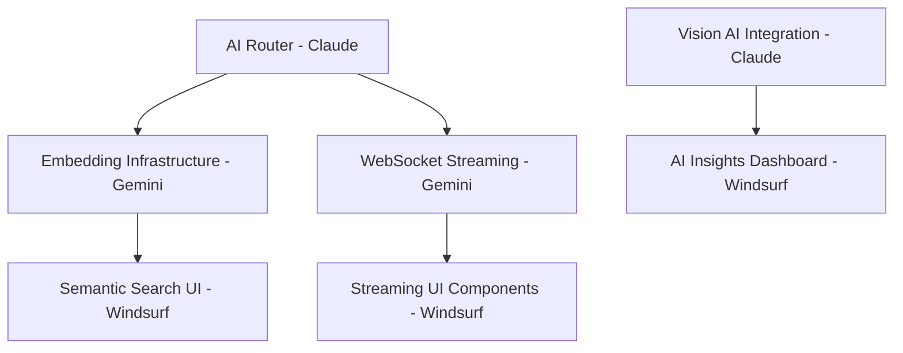

# 📊 PRSNL Project - Consolidated Task Tracker
*Last Updated: 2025-07-06*

## 🎯 Project Overview
PRSNL is a personal knowledge management system with video processing, AI-powered search, and content organization capabilities.

## 👥 Model Assignments & Status

### 🌊 WINDSURF (Frontend Specialist)
**Focus**: Frontend UI/UX, Video Display, AI Enhancement Features

#### ✅ Completed Tasks (Video Support Phase)
- [x] **WINDSURF-2025-07-06-001**: Video Display Enhancement
  - Enhanced VideoPlayer component with loading states, lazy loading, keyboard shortcuts
  - Updated timeline page with video support
  - Added fallback thumbnails and platform icons
  
- [x] **WINDSURF-2025-07-06-002**: Capture Page Video Support
  - Created URL utilities for video detection
  - Enhanced capture page with video-specific features
  
- [x] **WINDSURF-2025-07-06-003**: Search Results Video Support
  - Added video filters and platform selection
  - Implemented video thumbnail display in search results
  
- [x] **WINDSURF-2025-07-06-004**: Performance Optimization
  - Implemented virtual scrolling for timeline
  - Added intersection observer for lazy video loading
  - Note: Virtual scrolling currently disabled due to rendering issues

#### 📋 Pending Tasks
- [ ] **WINDSURF-2025-07-06-005**: Semantic Search UI (P0)
  - Implement "Find Similar" button on search results
  - Add relevance score indicators
  - Natural language search input
  - Files: `/frontend/src/routes/search/+page.svelte`, `/frontend/src/lib/components/SimilarItems.svelte`

- [ ] **WINDSURF-2025-07-06-006**: AI Insights Dashboard (P1)
  - Create `/insights` route with visualizations
  - Topic clusters using D3.js
  - Content trends and knowledge graph
  - Files: `/frontend/src/routes/insights/+page.svelte`

- [ ] **WINDSURF-2025-07-06-007**: Streaming UI Components (P1)
  - Real-time AI response streaming
  - Live tag suggestions
  - WebSocket integration
  - Files: `/frontend/src/lib/components/StreamingText.svelte`

### 🧠 GEMINI (Backend/Infrastructure)
**Focus**: Backend Services, Video Processing, Infrastructure

#### ✅ Completed Tasks (11 total)
- [x] Video download service with yt-dlp
- [x] Storage manager with thumbnail generation
- [x] Background task processing
- [x] Production Docker setup
- [x] Monitoring with Prometheus
- [x] CI/CD with GitHub Actions
- [x] Admin dashboard API
- [x] Telegram bot integration
- [x] Performance optimizations

#### 📋 Pending Tasks
- [ ] **GEMINI-2025-07-06-001**: Embedding Infrastructure (P0)
  - Implement embedding service for semantic search
  - PostgreSQL pgvector integration
  - Batch processing for existing items
  - Files: `/backend/app/services/embedding_service.py`

- [ ] **GEMINI-2025-07-06-002**: WebSocket Streaming (P1)
  - Real-time AI response streaming
  - Connection management
  - Integration with LLM processor
  - Files: `/backend/app/api/ws.py`

### 🤖 CLAUDE (Integration/Documentation)
**Focus**: API Integration, AI Enhancement, Documentation

#### ✅ Completed Tasks
- [x] Fixed frontend-backend API integration (camelCase vs snake_case)
- [x] Created comprehensive API documentation
- [x] Set up Chrome extension compatibility
- [x] Created AI enhancement task distribution
- [x] Started AI router and vision processor implementation

#### ✅ Completed Tasks
- [x] **CLAUDE-2025-07-06-001**: Vision AI Integration
  - Completed vision processor service with OCR and AI analysis
  - Implemented API endpoints for image/screenshot processing
  - Integrated with Azure OpenAI GPT-4V and Tesseract OCR fallback
  - Files: `/backend/app/services/vision_processor.py`, `/backend/app/api/vision.py`

- [x] **CLAUDE-2025-07-06-002**: AI Router Implementation
  - Implemented intelligent routing of AI tasks to providers
  - Added cost optimization and automatic fallback handling
  - Implemented usage tracking and metrics reporting
  - Files: `/backend/app/services/ai_router.py`

## 🔄 Task Dependencies

## 📈 Progress Summary
- **Total Tasks**: 26
- **Completed**: 18 (69%)
- **In Progress**: 2 (8%)
- **Pending**: 6 (23%)

## 🚧 Current Blockers
1. **aiofiles import error** in vision.py - needs Docker container rebuild
2. **Virtual scrolling** interfering with timeline display - disabled temporarily
3. **Embedding service** needed before semantic search UI can be fully implemented

## 📝 Documentation Status
- ✅ API Documentation (`API_DOCUMENTATION.md`)
- ✅ Model Coordination Rules (`MODEL_COORDINATION_RULES.md`)
- ✅ Demo Status (`DEMO_STATUS.md`)
- ⚠️ Model Activity Log - needs consolidation
- ⚠️ Task summaries - fragmented across multiple files

## 🎯 Next Actions
1. **Gemini**: Start embedding infrastructure implementation
2. **Windsurf**: Begin semantic search UI after embedding service is ready
3. **Claude**: Fix aiofiles import and complete vision AI integration

## 📋 Task ID Format
`[MODEL]-YYYY-MM-DD-###`
- MODEL: CLAUDE, GEMINI, WINDSURF
- Date: Task creation date
- Number: Sequential task number for that day

## 🔄 Update Protocol
1. All models update this single file
2. Move completed tasks to completed section
3. Update progress percentages
4. Note any new blockers or dependencies
5. Archive old completed tasks monthly