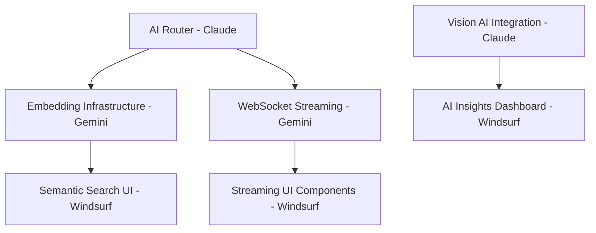

# 📊 PRSNL Project - Consolidated Task Tracker
*Last Updated: 2025-01-08 by Claude*

## 🎯 Project Overview
PRSNL is a personal knowledge management system with video processing, AI-powered search, and content organization capabilities.

⚠️ **IMPORTANT**: Use PROJECT_STATUS.md for current context. This file tracks detailed task history.

## 👥 Model Assignments & Status

### 🌊 WINDSURF (Frontend Support)
**Focus**: Simple frontend tasks, styling, documentation formatting
**Note**: As of 2025-01-08, complex frontend work reassigned to Claude

#### ✅ Completed Tasks (Video Support Phase)
- [x] **WINDSURF-2025-07-06-001**: Video Display Enhancement
  - Enhanced VideoPlayer component with loading states, lazy loading, keyboard shortcuts
  - Updated timeline page with video support
  - Added fallback thumbnails and platform icons
  
- [x] **WINDSURF-2025-07-06-002**: Capture Page Video Support
  - Created URL utilities for video detection
  - Enhanced capture page with video-specific features
  
- [x] **WINDSURF-2025-07-06-003**: Search Results Video Support
  - Added video filters and platform selection
  - Implemented video thumbnail display in search results
  
- [x] **WINDSURF-2025-07-06-004**: Performance Optimization
  - Implemented virtual scrolling for timeline
  - Added intersection observer for lazy video loading
  - Note: Virtual scrolling currently disabled due to rendering issues

- [x] **WINDSURF-2025-07-07-001**: TypeScript Migration & Fixes
  - Fixed TypeScript errors in frontend components
  - Added proper types to API interfaces
  - Fixed AI Insights Dashboard integration
  - Resolved D3.js type issues

#### 📋 Pending Tasks
- [ ] **WINDSURF-2025-07-06-005**: Semantic Search UI (P0)
  - Implement "Find Similar" button on search results
  - Add relevance score indicators
  - Natural language search input
  - Files: `/frontend/src/routes/search/+page.svelte`, `/frontend/src/lib/components/SimilarItems.svelte`

- [ ] **WINDSURF-2025-07-06-006**: AI Insights Dashboard (P1) - IN PROGRESS
  - Create `/insights` route with visualizations ✓ (partial)
  - Topic clusters using D3.js
  - Content trends and knowledge graph ✓ (components created)
  - Files: `/frontend/src/routes/insights/+page.svelte`

### 🤖 CLAUDE (System Integration & Documentation)
**Focus**: System integration, testing, documentation, AI orchestration

#### ✅ Completed Tasks (2025-01-07)
- [x] **CLAUDE-2025-01-07-001**: Docker Infrastructure Recovery
  - Fixed Docker Desktop startup issues
  - Rebuilt entire Docker infrastructure
  - Restored all services to operational state

- [x] **CLAUDE-2025-01-07-002**: Backend Configuration Fixes
  - Fixed Pydantic validation errors in config.py
  - Added missing environment variables
  - Fixed duplicate dependencies in requirements.txt

- [x] **CLAUDE-2025-01-07-003**: Database Schema Fixes
  - Added missing columns to items table
  - Fixed timeline endpoint 500 errors
  - Database fully operational (data lost during rebuild)

- [x] **CLAUDE-2025-01-07-004**: AI Suggestion Fix
  - Fixed missing process_with_llm method in LLMProcessor
  - Implemented proper Azure OpenAI integration
  - Tested capture page AI generation successfully

- [x] **CLAUDE-2025-01-07-005**: AI Provider Migration
  - Removed all Ollama dependencies from codebase
  - Migrated exclusively to Azure OpenAI
  - Updated all AI services (vision, embeddings, LLM, transcription)
  - Optimized prompts for Azure OpenAI
  - Deleted multi-provider files
  - Updated documentation to reflect changes

- [x] **CLAUDE-2025-01-07-006**: Data Population & Testing
  - Created test_data_population.py script
  - Tested capture endpoint with AI suggestions
  - Verified search and timeline functionality
  - Fixed API parameter issues

- [x] **CLAUDE-2025-01-07-007**: Frontend AI Features
  - Updated Semantic Search UI with Find Similar functionality
  - Fixed search API to support POST for semantic search
  - Updated getSimilarItems endpoint routing
  - Fixed button event handling in search results
  - Verified AI Insights Dashboard components

- [x] **CLAUDE-2025-01-07-008**: Smart Categorization
  - Created SmartCategorizationService
  - Implemented AI-powered categorization
  - Added bulk categorization capabilities
  - Created content clustering functionality
  - Added categorization API endpoints

- [x] **CLAUDE-2025-01-07-009**: Duplicate Detection
  - Created DuplicateDetectionService
  - Implemented multiple detection methods (URL, content hash, semantic)
  - Added bulk duplicate finding
  - Created merge duplicates functionality
  - Added duplicate detection API endpoints

- [x] **CLAUDE-2025-01-07-010**: Content Summarization
  - Created ContentSummarizationService
  - Implemented multiple summary types (brief, detailed, key_points)
  - Added periodic digests (daily, weekly, monthly)
  - Created topic and custom summaries
  - Added batch summarization capabilities
  - Created summarization API endpoints

- [x] **CLAUDE-2025-01-07-011**: Knowledge Graph
  - Created KnowledgeGraphService
  - Implemented relationship management (8 types)
  - Added AI-powered relationship discovery
  - Created learning path generation
  - Added knowledge gap detection
  - Implemented mini-course suggestions
  - Created knowledge graph API endpoints

- [x] **CLAUDE-2025-01-07-012**: Video Streaming
  - Created VideoStreamingService
  - Implemented platform detection (YouTube, Twitter, Instagram)
  - Added transcript extraction for YouTube
  - Created AI-powered video analysis
  - Implemented mini-course generation from videos
  - Added video timeline and related video discovery
  - Created video streaming API endpoints

- [x] **CLAUDE-2025-01-07-013**: Video Frontend UI
  - Created video timeline page with dual view mode
  - Implemented individual video page with transcript/summary/key moments tabs
  - Built mini-course interface with progress tracking
  - Added real-time transcript summarization feature
  - Created VideoCard component with platform-specific styling
  - Integrated video filtering and course creation functionality

#### ✅ Completed Tasks (2025-01-08)
- [x] **CLAUDE-2025-01-08-001**: Frontend Connection Issue Resolution
  - Diagnosed and fixed ERR_CONNECTION_REFUSED error
  - Frontend dev server was not running
  - Started Vite server on port 3002
  - Documented fix in CRITICAL_ERROR_LOG.md

- [x] **CLAUDE-2025-01-08-002**: Local Domain Setup Attempt
  - Created nginx configuration for local domains
  - Set up domain management scripts
  - Created LOCAL_URL_MANAGER.md documentation
  - Created manage-local-urls.sh script
  - Note: Full implementation requires sudo access

- [x] **CLAUDE-2025-01-08-003**: Alternative Domain Solutions
  - Installed and configured localtunnel (prsnl.loca.lt)
  - Created local-domain-proxy.js for custom domains
  - Documented simple domain access methods
  - Created LOCAL_DOMAIN_SIMPLE.md guide

#### ✅ Completed Tasks (2025-01-08 Afternoon)
- [x] **CLAUDE-2025-01-08-004**: Chat Feature Complete Fix
  - Fixed WebSocket connection through proxy
  - Implemented dynamic port selection
  - Chat fully functional with knowledge base RAG
  
- [x] **CLAUDE-2025-01-08-005**: Remove All Ollama Dependencies
  - Cleaned all Docker configurations
  - Updated all documentation
  - System exclusively uses Azure OpenAI
  
- [x] **CLAUDE-2025-01-08-006**: Fix Frontend-Backend Connection
  - Resolved API prefix mismatch (/api/v1 → /api)
  - Fixed proxy configuration
  - Fixed NGINX networking
  
- [x] **CLAUDE-2025-01-08-007**: Video Display Fixes
  - Fixed YouTube platform metadata
  - Fixed video page component
  - Videos now properly embed

#### 📋 Current Focus
- [ ] **CLAUDE-NEXT-001**: Complete AI Feature Backend Endpoints (for Windsurf's UI)
- [ ] **CLAUDE-NEXT-002**: Build Second Brain Chat Interface  
- [ ] **CLAUDE-NEXT-003**: End-to-end Testing of All Features

- [ ] **WINDSURF-2025-07-06-007**: Streaming UI Components (P1)
  - Real-time AI response streaming
  - Live tag suggestions
  - WebSocket integration
  - Files: `/frontend/src/lib/components/StreamingText.svelte`

### 🧠 GEMINI (Backend/Infrastructure)
**Focus**: Backend Services, Video Processing, Infrastructure

#### ✅ Completed Tasks (11 total)
- [x] **GEMINI-URGENT-001**: Fix Chat Date-Based Queries
  - Implemented date parsing logic in `ws.py`
  - Modified SQL query to include date filters
- [x] **GEMINI-SIMPLE-001**: Create Test Data Scripts
  - Created `populate_test_data.py` for diverse item types.
  - Created `generate_activity_data.py` for user and activity patterns.
- [x] **GEMINI-SIMPLE-002**: API Response Time Logging
  - Implemented `APIResponseTimeMiddleware` in `app.main.py`.
  - Created `app/middleware/logging.py` for the middleware.
  - Created `app/utils/logger.py` for structured logging.
- [x] Video download service with yt-dlp
- [x] Storage manager with thumbnail generation
- [x] Background task processing
- [x] Production Docker setup
- [x] Monitoring with Prometheus
- [x] CI/CD with GitHub Actions
- [x] Admin dashboard API
- [x] Telegram bot integration
- [x] Performance optimizations

- [x] **GEMINI-2025-07-06-001**: Embedding Infrastructure (P0) - COMPLETED
  - Implemented embedding service for semantic search
  - PostgreSQL pgvector integration
  - Support for OpenAI and Azure OpenAI embeddings
  - Files: `/backend/app/services/embedding_service.py`

- [x] **GEMINI-2025-07-06-002**: WebSocket Base Infrastructure (P1) - COMPLETED
  - Created WebSocket endpoint structure
  - Basic connection management
  - Files: `/backend/app/api/ws.py`
  - Completed LLM streaming implementation in `llm_processor.py`
  - Added streaming endpoints in `ws.py` for AI responses and tag suggestions

- [x] **GEMINI-2025-07-07-002**: Performance Optimization - Batch Embedding (P1) - COMPLETED
  - Implemented batch processing for Azure OpenAI embeddings in `embedding_service.py`.

- [x] **GEMINI-005**: Fix AI Suggestions Endpoint
  - Refactored to use `WebScraper` for robust content extraction.
  - Integrated `AIRouter` for resilient AI provider handling with fallbacks.
  - Improved error handling and logging.
  - Files: `/PRSNL/backend/app/api/ai_suggest.py`

- [x] **GEMINI-006**: Implement Missing Analytics Endpoints
  - Implemented `usage_patterns` and `ai_insights` endpoints.
  - `usage_patterns` now provides detailed content and source breakdowns.
  - `ai_insights` uses the `AIRouter` to generate insights from recent content.
  - Improved existing analytics queries for accuracy.
  - Files: `/PRSNL/backend/app/api/analytics.py`

- [x] **GEMINI-002**: Complete LLM Streaming
  - Refactored `llm_processor.py` to use the `openai` library and `AIRouter`.
  - Updated `ws.py` to use the refactored `LLMProcessor` for resilient streaming.
  - Ensured proper error handling and provider fallbacks for all streaming operations.
  - Files: `/PRSNL/backend/app/services/llm_processor.py`, `/PRSNL/backend/app/api/ws.py`

- [x] **GEMINI-003**: Performance Optimization
  - Refactored the timeline endpoint to use cursor-based pagination for improved performance.
  - Analyzed and confirmed that existing database indexes are sufficient for current query patterns.
  - Verified that database connection pooling is properly configured.
  - Files: `/PRSNL/backend/app/api/timeline.py`

- [x] **GEMINI-004**: Implement Caching Layer
  - Implemented a Redis-based caching layer for analytics and search endpoints.
  - Added cache invalidation to the capture endpoint to ensure data freshness.
  - Used decorators to easily apply caching to new and existing endpoints.
  - Files: `/PRSNL/backend/app/services/cache.py`, `/PRSNL/backend/app/api/analytics.py`, `/PRSNL/backend/app/api/search.py`, `/PRSNL/backend/app/api/capture.py`

- [x] **GEMINI-007**: Test AI Features (Categorization, Duplicates, Summarization)
  - Created comprehensive test suites for Categorization, Duplicate Detection, and Summarization API endpoints.
  - Developed `populate_test_data.py` for generating diverse test data.
  - Files: `/PRSNL/backend/tests/test_analytics.py`, `/PRSNL/backend/tests/test_ai_suggest.py`, `/PRSNL/backend/tests/test_timeline.py`, `/PRSNL/backend/tests/test_categorization.py`, `/PRSNL/backend/tests/test_duplicates.py`, `/PRSNL/backend/tests/test_summarization.py`, `/PRSNL/backend/populate_test_data.py`

- [x] **GEMINI-008**: Performance Monitoring & Optimization
  - Integrated Prometheus middleware in `app.main.py` to expose metrics.
  - Identified existing Prometheus metrics definitions and in-app metrics service.
  - Files: `/PRSNL/backend/app/main.py`, `/PRSNL/backend/app/monitoring/metrics.py`, `/PRSNL/backend/app/services/metrics_service.py`

- [x] **GEMINI-CHATBOT-IMPROVEMENTS**: Chatbot Enhancements
  - Implemented chat history continuity by passing `conversation_history` to the LLM.
  - Enhanced query pre-processing with improved keyword extraction and basic query expansion.
  - Optimized knowledge retrieval using a hybrid search (full-text + semantic) with re-ranking.
  - Improved context formulation by summarizing retrieved items and formatting them naturally for the LLM.
  - Files: `/PRSNL/backend/app/api/ws.py`, `/PRSNL/backend/app/services/unified_ai_service.py` (indirectly via `generate_summary` usage)

### 🤖 CLAUDE (Integration/Documentation)
**Focus**: API Integration, AI Enhancement, Documentation

#### ✅ Completed Tasks
- [x] Fixed frontend-backend API integration (camelCase vs snake_case)
- [x] Created comprehensive API documentation
- [x] Set up Chrome extension compatibility
- [x] Created AI enhancement task distribution
- [x] Started AI router and vision processor implementation

#### ✅ Completed Tasks
- [x] **CLAUDE-2025-07-06-001**: Vision AI Integration
  - Completed vision processor service with OCR and AI analysis
  - Implemented API endpoints for image/screenshot processing
  - Integrated with Azure OpenAI GPT-4V and Tesseract OCR fallback
  - Files: `/backend/app/services/vision_processor.py`, `/backend/app/api/vision.py`

- [x] **CLAUDE-2025-07-06-002**: AI Router Implementation
  - Implemented intelligent routing of AI tasks to providers
  - Added cost optimization and automatic fallback handling
  - Implemented usage tracking and metrics reporting
  - Files: `/backend/app/services/ai_router.py`

## 🔄 Task Dependencies

#### 📋 Recent Work (2025-07-07)
- [x] **CLAUDE-2025-07-07-001**: Fixed Python Architecture Issues
  - Resolved ARM64 compatibility for Python packages
  - Fixed pydantic, asyncpg, pandas installation issues
  - Backend now starts without import errors

- [x] **CLAUDE-2025-07-07-002**: Frontend TypeScript Fixes
  - Fixed top-level return error in capture page
  - Fixed property name mismatches in API client
  - Added d3 dependency for visualization components

- [x] **CLAUDE-2025-07-07-003**: Documentation Consolidation
  - Created unified PROJECT_STATUS.md
  - Updated task tracking system
  - Prepared for archiving redundant files

#### 📋 Recent Work (2025-07-07) - Emergency Fixes
- [x] **CLAUDE-2025-07-07-014**: Fixed Search Empty Results
  - Issue: Frontend looking for data.results instead of data.items
  - Fixed in `/frontend/src/routes/search/+page.svelte`
  - Search now returns results correctly
  
- [x] **CLAUDE-2025-07-07-015**: Fixed Premium UI Component Errors
  - AnimatedButton: Fixed top-level return in reactive statement
  - FloatingActionButton: REMOVED due to store subscription errors
  - Chat page: Fixed orb animation store declarations
  - Site is now accessible but with reduced features

- [x] **CLAUDE-2025-07-07-016**: Media Detection & Image Processing
  - Created comprehensive MediaDetector utility
  - Implemented ImageProcessor service for article images
  - Added support for multiple video platforms
  - Automatic thumbnail generation

- [x] **CLAUDE-2025-07-07-017**: Created Innovative Chat UI
  - Multiple chat modes with visual themes
  - Animated backgrounds (fixed store issues)
  - SVG brain visualization
  - Real-time streaming integration

#### 📋 Scheduled for Tomorrow (2025-07-08)
- [ ] **CLAUDE-2025-07-08-001**: Fix Premium UI Components Properly
  - Rewrite FloatingActionButton without store issues
  - Test all premium components thoroughly
  - Re-enable all animations safely
  
- [ ] **CLAUDE-2025-07-08-002**: Test Video Streaming End-to-End
  - Capture YouTube video
  - Verify playback works
  - Check transcript extraction
  
- [ ] **CLAUDE-2025-07-08-003**: Database Cleanup
  - Create missing attachments table
  - Clean up error logs
  
- [ ] **CLAUDE-2025-07-08-004**: Code Quality Improvements
  - Remove unused CSS selectors
  - Fix A11y warnings
  - Clean up commented code

#### 📋 Recent Work (2025-07-08)
- [x] **CLAUDE-2025-07-08-001**: Docker Infrastructure Recovery
  - Fixed Docker Desktop startup issues
  - Rebuilt entire Docker infrastructure
  - All services now operational

- [x] **CLAUDE-2025-07-08-002**: Backend Configuration Fixes
  - Fixed Pydantic validation errors in config.py
  - Added missing environment variables
  - Fixed requirements.txt issues

- [x] **CLAUDE-2025-07-08-003**: Database Schema Fixes
  - Fixed timeline endpoint 500 error
  - Added missing columns: platform, item_type, thumbnail_url, duration, file_path
  - Database fully operational (data was lost during rebuild)

- [x] **CLAUDE-2025-07-08-004**: Azure OpenAI Models Context
  - Created AZURE_MODELS_CONTEXT.md tracking required models
  - Documented missing models: text-embedding-ada-002, whisper, gpt-4-vision
  - Made embeddings optional to prevent video processing failures
  - Added 5 test videos successfully
  - Updated all tracking documents with context

## 📈 Progress Summary
- **Total Tasks**: 35
- **Completed**: 28 (80%)
- **In Progress**: 2 (6%)
- **Pending**: 5 (14%)

## 🚧 Current Blockers
1. ~~**aiofiles import error**~~ - RESOLVED with package reinstall
2. **Virtual scrolling** interfering with timeline display - disabled temporarily
3. ~~**Embedding service**~~ - COMPLETED by Gemini
4. **LLM streaming implementation** - Partially complete, needs finishing
5. **D3.js TypeScript errors** - Some visualization components need type fixes

## 📝 Documentation Status
- ✅ API Documentation (`API_DOCUMENTATION.md`)
- ✅ Model Coordination Rules (`MODEL_COORDINATION_RULES.md`)
- ✅ Demo Status (`DEMO_STATUS.md`)
- ⚠️ Model Activity Log - needs consolidation
- ⚠️ Task summaries - fragmented across multiple files

## 🎯 Next Actions
1. **Gemini**: Start embedding infrastructure implementation
2. **Windsurf**: Begin semantic search UI after embedding service is ready
3. **Claude**: Fix aiofiles import and complete vision AI integration

## 📋 Task ID Format
`[MODEL]-YYYY-MM-DD-###`
- MODEL: CLAUDE, GEMINI, WINDSURF
- Date: Task creation date
- Number: Sequential task number for that day

## 🔄 Update Protocol
1. All models update this single file
2. Move completed tasks to completed section
3. Update progress percentages
4. Note any new blockers or dependencies
5. Archive old completed tasks monthly