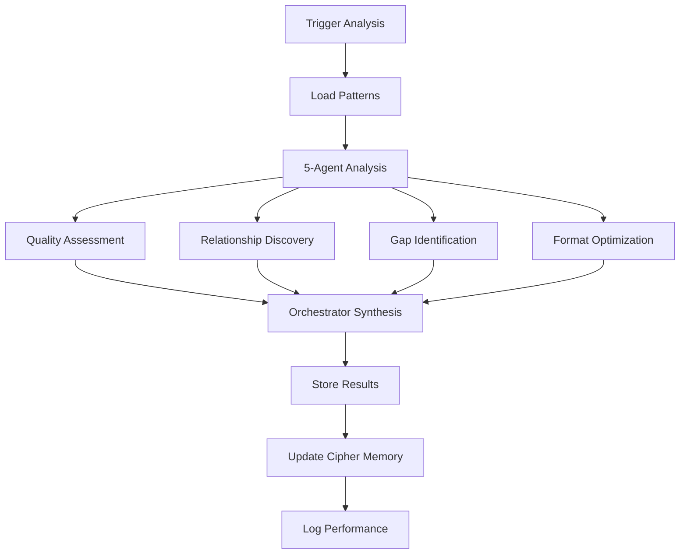

# Cipher Pattern Analysis Automation

> **Revolutionary self-improving AI memory system for PRSNL development**

## 🌟 Overview

The Cipher Pattern Analysis Automation system uses a 5-agent CrewAI team to continuously analyze and improve Cipher memory patterns, creating a self-improving AI knowledge base that enhances Claude Code agent effectiveness over time.

## 🧠 How It Works

### CrewAI Multi-Agent Analysis

The system employs 5 specialized AI agents working together:

1. **Pattern Quality Agent**: Analyzes completeness, accuracy, and clarity
2. **Pattern Relationship Agent**: Discovers connections between patterns
3. **Pattern Gap Agent**: Identifies missing knowledge areas
4. **Pattern Optimization Agent**: Suggests format improvements
5. **Pattern Orchestrator Agent**: Synthesizes insights and creates improvement plans

### Automated Workflow



## 🚀 Getting Started

### Prerequisites

1. **Backend Running**: Ensure PRSNL backend is running on port 8000
2. **Azure OpenAI Configured**: CrewAI requires Azure OpenAI access
3. **Cipher Memory Active**: At least 10+ patterns in Cipher memory

### Quick Start

```bash
# Navigate to scripts directory
cd /Users/pronav/Personal\ Knowledge\ Base/PRSNL/scripts

# Run full analysis
./cipher-pattern-analysis.sh

# Check status
./cipher-analysis-status.sh
```

## 📋 Command Reference

### Main Analysis Script: `cipher-pattern-analysis.sh`

#### Basic Usage
```bash
./cipher-pattern-analysis.sh [analysis_type] [mode]
```

#### Analysis Types
- **`full`** (default): Comprehensive analysis of all aspects
- **`quality`**: Focus on pattern quality issues
- **`relationships`**: Focus on pattern connections
- **`gaps`**: Focus on knowledge gaps
- **`optimization`**: Focus on format improvements

#### Execution Modes
- **`sync`** (default): Wait for analysis completion
- **`async`**: Run analysis in background

#### Special Commands
```bash
./cipher-pattern-analysis.sh --status    # Show last run status
./cipher-pattern-analysis.sh --check     # Check if analysis is overdue
./cipher-pattern-analysis.sh --help      # Show usage information
```

#### Examples
```bash
# Full synchronous analysis (recommended weekly)
./cipher-pattern-analysis.sh

# Quick quality check in background
./cipher-pattern-analysis.sh quality async

# Relationship analysis with immediate results
./cipher-pattern-analysis.sh relationships sync

# Check if analysis is needed
./cipher-pattern-analysis.sh --check
```

### Status Utility: `cipher-analysis-status.sh`

#### Commands
```bash
./cipher-analysis-status.sh status      # Quick status (default)
./cipher-analysis-status.sh history     # Detailed run history
./cipher-analysis-status.sh trends      # Quality trends analysis
./cipher-analysis-status.sh schedule    # Next scheduled analysis
./cipher-analysis-status.sh clean       # Clean old log entries
./cipher-analysis-status.sh summary     # Comprehensive overview
```

#### Examples
```bash
# Quick status check
./cipher-analysis-status.sh

# View quality trends
./cipher-analysis-status.sh trends

# See run history
./cipher-analysis-status.sh history

# Comprehensive overview
./cipher-analysis-status.sh summary
```

## 🕒 Automation Schedule

### Automatic Triggers

1. **Weekly Schedule**: Every Sunday at 2 AM
2. **Activity-Based**: After >10 new patterns added
3. **Agent-Triggered**: When agents detect pattern quality issues
4. **Manual**: On-demand execution

### Setting Up Cron Job

```bash
# Edit crontab
crontab -e

# Add weekly analysis (Sundays at 2 AM)
0 2 * * 0 cd /Users/pronav/Personal\ Knowledge\ Base/PRSNL/scripts && ./cipher-pattern-analysis.sh quality async

# Add daily status check (optional)
0 9 * * * cd /Users/pronav/Personal\ Knowledge\ Base/PRSNL/scripts && ./cipher-analysis-status.sh --check
```

## 📊 Monitoring & Logging

### Log Files

#### Analysis Run Log: `scripts/data/cipher-analysis-runs.log`
CSV format tracking all analysis runs:
```csv
timestamp,status,duration_seconds,pattern_count,quality_score,message
2025-08-01 14:30:00,success,45,50,85.59,"Analysis completed successfully"
2025-08-01 14:35:00,error,12,50,85.59,"Backend not available"
```

#### Error Log: `scripts/cipher-analysis-errors.log`
Detailed error information for troubleshooting:
```
[2025-08-01 14:35:00] ERROR: Backend not available at http://localhost:8000
[2025-08-01 14:40:00] ERROR: Analysis API call failed (timeout)
```

### Performance Metrics

- **Analysis Duration**: Typical range 30-120 seconds
- **Pattern Coverage**: Number of patterns analyzed
- **Quality Score**: Composite quality metric (0-100%)
- **Success Rate**: Percentage of successful runs
- **Trend Analysis**: Quality improvement over time

### Cipher Memory Integration

Analysis results are automatically stored in Cipher memory:
```bash
# View analysis results
./prsnl-cipher.sh recall "PATTERN ANALYSIS"

# View specific insights
./prsnl-cipher.sh recall "ANALYSIS INSIGHT"
```

## 🔧 Configuration

### Environment Variables

The system uses existing PRSNL configuration:
```bash
AZURE_OPENAI_API_KEY=your_key
AZURE_OPENAI_ENDPOINT=https://your-resource.openai.azure.com
AZURE_OPENAI_DEPLOYMENT=gpt-4.1
AZURE_OPENAI_API_VERSION=2025-01-01-preview
```

### Script Configuration

Edit `cipher-pattern-analysis.sh` for custom settings:
```bash
BACKEND_URL="http://localhost:8000"  # Backend URL
ANALYSIS_TIMEOUT=300                  # 5 minutes timeout
```

## 📈 Quality Metrics

### Current Performance (Baseline)
- **Total Patterns**: 50
- **Pattern Types**: 10 categories
- **Quality Score**: 85.59%
- **Solution Coverage**: 76% (38/50 patterns have solutions)
- **Average Content Length**: 99.98 characters

### Target Improvements
- **Quality Score**: 85.59% → 90%+ within 4 weeks
- **Solution Coverage**: 76% → 90%+ within 2 weeks
- **Context Coverage**: 60% → 80%+ patterns with file/location info
- **Format Consistency**: 70% → 95%+ standardized formats

### Quality Assessment Criteria

#### Pattern Completeness (30% weight)
- Sufficient detail (>50 characters)
- Clear problem description
- Context information included

#### Solution Coverage (30% weight)
- Bug patterns include solutions
- Solutions are actionable
- Solutions reference specific locations

#### Context Validation (25% weight)
- File paths included
- Service names specified
- Component locations provided

#### Format Consistency (15% weight)
- Standardized pattern prefixes
- Consistent structure
- Proper categorization

## 🔄 Agent Integration

### Automatic Integration

All 6 Claude Code agents automatically:

1. **Pre-Task Check**: Verify if analysis is overdue
2. **Pattern Discovery**: Store new patterns during task execution
3. **Auto-Trigger**: Start analysis if >5 new patterns discovered
4. **Quality Reference**: Use improved patterns for better responses

### Agent-Specific Behavior

#### debug-accelerator
- Triggers analysis after fixing >3 bugs
- Stores bug patterns with solutions
- References existing bug patterns for faster resolution

#### general-purpose
- Triggers analysis after complex searches
- Stores search patterns and results
- Uses relationship patterns for better context

#### ui-ux-optimizer
- Triggers analysis after component audits
- Stores UI patterns and best practices
- References accessibility patterns

## 🛠️ Troubleshooting

### Common Issues

#### Analysis Fails to Start
```bash
# Check backend availability
curl http://localhost:8000/health

# Check cipher analysis endpoint
curl http://localhost:8000/api/cipher-analysis/health

# Start backend if needed
cd backend && source venv/bin/activate && uvicorn app.main:app --reload --port 8000
```

#### Azure OpenAI Errors
```bash
# Verify environment variables
echo $AZURE_OPENAI_API_KEY
echo $AZURE_OPENAI_ENDPOINT

# Test Azure OpenAI connectivity
curl -H "api-key: $AZURE_OPENAI_API_KEY" \
     "$AZURE_OPENAI_ENDPOINT/openai/models?api-version=2025-01-01-preview"
```

#### Analysis Timeout
- Increase timeout in script configuration
- Use async mode for background processing
- Check system resources and network connectivity

#### Low Quality Scores
- Review quality issues: `curl http://localhost:8000/api/cipher-analysis/quality-issues`
- Add missing context to patterns manually
- Use recommendations from analysis results

### Debug Commands

```bash
# Check analysis status
./cipher-analysis-status.sh

# View error logs
tail -f scripts/cipher-analysis-errors.log

# Test API endpoint
curl -X POST http://localhost:8000/api/cipher-analysis/analyze \
  -H "Content-Type: application/json" \
  -d '{"analysis_type": "quality", "async_mode": true}'

# View recent analysis results
./prsnl-cipher.sh recall "PATTERN ANALYSIS"
```

## 📝 Best Practices

### Regular Maintenance

1. **Weekly Reviews**: Check trends and quality improvements
2. **Monthly Cleanup**: Clean old logs to maintain performance
3. **Quarterly Assessment**: Review automation effectiveness
4. **Pattern Curation**: Manually review and improve high-impact patterns

### Pattern Quality Guidelines

#### Good Pattern Example
```
BUG PATTERN: WebSocket 403 errors → Add endpoint to PUBLIC_ROUTES in auth middleware
Context: /backend/app/middleware/auth.py line 45
Solution: Add '/api/ws' to PUBLIC_ROUTES list
Impact: Fixes real-time features failing authentication
```

#### Poor Pattern Example
```
Something broken → fix it
```

### Performance Optimization

1. **Use Async Mode**: For automated runs to avoid blocking
2. **Targeted Analysis**: Use specific analysis types when appropriate
3. **Batch Operations**: Run analysis after major development sessions
4. **Monitor Resources**: Ensure adequate system resources during analysis

## 🔮 Future Enhancements

### Planned Features

1. **Smart Scheduling**: Dynamic scheduling based on development activity
2. **Pattern Templates**: Automated pattern format suggestions
3. **Quality Predictions**: ML-based quality score predictions
4. **Team Analytics**: Multi-developer pattern analysis
5. **Integration APIs**: REST APIs for external tool integration

### Advanced Automation

1. **Continuous Learning**: Real-time pattern improvement
2. **Semantic Search**: Enhanced pattern discovery using embeddings
3. **Auto-Categorization**: AI-powered pattern categorization
4. **Duplicate Detection**: Automated duplicate pattern removal
5. **Version Control**: Pattern history and versioning

## 📚 Related Documentation

- [CIPHER_IMPLEMENTATION.md](CIPHER_IMPLEMENTATION.md) - Core Cipher system setup
- [CIPHER_QUICK_WINS.md](CIPHER_QUICK_WINS.md) - High-ROI Cipher improvements
- [SYSTEM_ARCHITECTURE_REPOSITORY.md](SYSTEM_ARCHITECTURE_REPOSITORY.md) - System architecture patterns

## 🤝 Contributing

### Adding Custom Analysis Types

1. Extend analysis types in `cipher-pattern-analysis.sh`
2. Add corresponding logic in CrewAI agents
3. Update documentation and help text
4. Test with existing pattern set

### Enhancing Quality Metrics

1. Modify quality calculation in `CipherPatternTool`
2. Add new quality criteria
3. Update target thresholds
4. Document new metrics

---

**The Cipher Pattern Analysis Automation system represents a breakthrough in self-improving AI memory, creating a continuously evolving knowledge base that enhances development productivity and code quality through intelligent pattern recognition and improvement.**