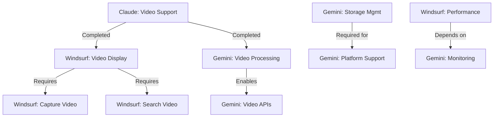

# MODEL TASK TRACKER - PRSNL Project

> Centralized tracking for all AI model tasks across the project

## Task Status Legend
- 📋 **PLANNED**: Task defined, not started
- 🚧 **IN PROGRESS**: Currently being worked on
- ⏸️ **BLOCKED**: Waiting on dependencies
- ✅ **COMPLETED**: Successfully finished
- ❌ **FAILED**: Could not complete
- 🔄 **IN REVIEW**: Completed, awaiting review

---

## Active Tasks by Model

### 🤖 CLAUDE (Orchestrator)
| Task ID | Description | Status | Started | Completed |
|---------|------------|---------|---------|-----------|
| CLAUDE-2025-07-06-001 | Instagram video support | ✅ COMPLETED | 2025-07-06 | 2025-07-06 |
| CLAUDE-2025-01-06-001 | Backend integration | ✅ COMPLETED | 2025-01-06 | 2025-01-06 |

### 🌊 WINDSURF (Frontend)
| Task ID | Description | Status | Started | Completed |
|---------|------------|---------|---------|-----------|
| WINDSURF-2025-07-06-001 | Video display enhancement | 📋 PLANNED | - | - |
| WINDSURF-2025-07-06-002 | Capture page video support | 📋 PLANNED | - | - |
| WINDSURF-2025-07-06-003 | Search results video support | 📋 PLANNED | - | - |
| WINDSURF-2025-07-06-004 | Performance optimization | 📋 PLANNED | - | - |

### ♊ GEMINI (Backend)
| Task ID | Description | Status | Started | Completed |
|---------|------------|---------|---------|-----------|
| GEMINI-2025-07-06-001 | Video processing optimization | 📋 PLANNED | - | - |
| GEMINI-2025-07-06-002 | Storage management system | 📋 PLANNED | - | - |
| GEMINI-2025-07-06-003 | Video API endpoints | 📋 PLANNED | - | - |
| GEMINI-2025-07-06-004 | Platform support extension | 📋 PLANNED | - | - |
| GEMINI-2025-07-06-005 | Telegram bot integration | 📋 PLANNED | - | - |
| GEMINI-2025-07-06-006 | Performance monitoring | 📋 PLANNED | - | - |

---

## Task Dependencies

---

## Integration Points

### Video Feature Integration
**Components Affected**:
1. **Database**: New schema with video support
2. **Backend**: Video processing service
3. **Frontend**: VideoPlayer component
4. **Storage**: Media directories in Docker

**Key Files for All Models**:
- `/PRSNL/backend/app/services/video_processor.py`
- `/PRSNL/backend/app/db/migrations/002_add_video_support.sql`
- `/PRSNL/frontend/src/lib/components/VideoPlayer.svelte`
- `/PRSNL/docker-compose.yml`

---

## Collaboration Protocol

### Before Starting a Task
1. Check this tracker for dependencies
2. Update status to 🚧 IN PROGRESS
3. Review relevant files in task description
4. Check MODEL_ACTIVITY_LOG.md for context

### During Development
1. Update MODEL_ACTIVITY_LOG.md with progress
2. If blocked, update status and reason
3. Create new subtasks if needed
4. Coordinate through task comments

### After Completion
1. Update status to 🔄 IN REVIEW
2. List all modified files
3. Document any new dependencies
4. Update integration test requirements

---

## Priority Matrix

### Critical Path (Must Complete First)
1. **Windsurf**: Video display enhancement (UI critical)
2. **Gemini**: Video processing optimization (performance critical)

### High Priority
1. **Windsurf**: Capture page video support
2. **Gemini**: Storage management system
3. **Gemini**: Telegram bot integration (FREE solution for link capture)

### Medium Priority
1. **Windsurf**: Search results video support
2. **Gemini**: Video API endpoints
3. **Gemini**: Platform support extension

### Low Priority
1. **Windsurf**: Performance optimization
2. **Gemini**: Performance monitoring

---

## Notes
- All models should update MODEL_ACTIVITY_LOG.md after completing tasks
- Use task IDs consistently across all documentation
- Frontend (Windsurf) runs on port 3002
- Backend (Gemini) runs in Docker on port 8000
- Claude coordinates and reviews all integrations